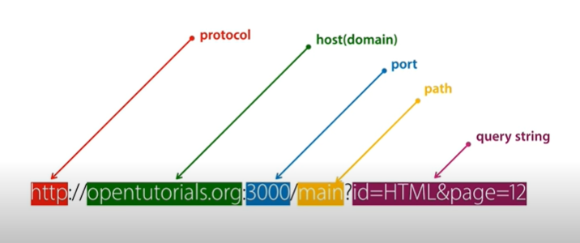
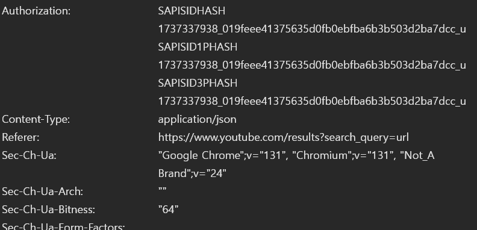
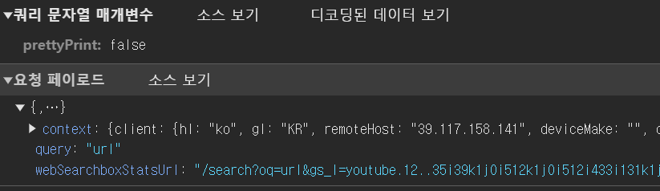
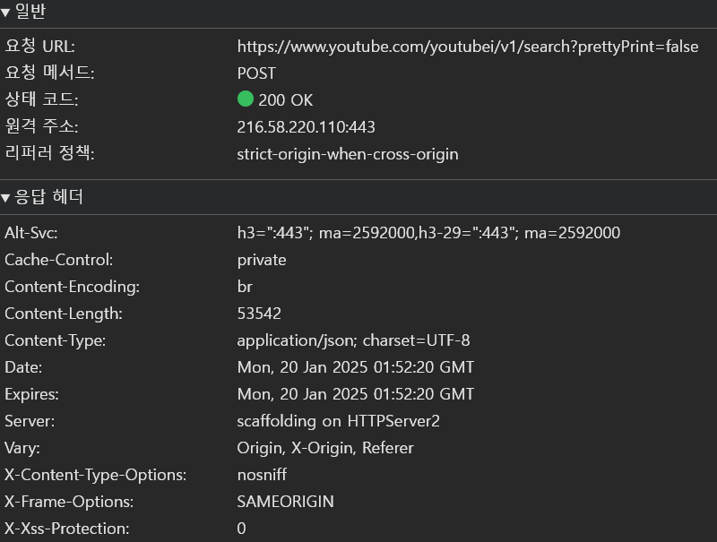

# 1. URL에서의 쿼리



같은 페이지 내의 요청에 대해 추가적인 옵션이 필요할 때 URL의 마지막에 ?이후 따라오는 쿼리스트링 부분이다. 설계에 따라 내용은 제각각이지만 A=B&C=D와 같은 기본적인 문법은 동일하며 단순하다.

```
https://www.youtube.com/results?search_query=url
```

유튜브에서 'url'을 검색할 때 나타내는 url이다. ?뒤에 search_query라는 변수에 대해 'url'을 넘겨주는 모습을 볼 수 있다.

---

# 2. HTTP를 통한 데이터 송신 시의 Request와 Response

HTTP 통신은 요청과 응답의 반복으로 이루어진다.



유튜브에서 'url'을 검색하는 요청의 헤더부분이다. 통신 규약에 따라 필요한 항목과 개별적으로 구현한 요구 항목을 포함하여 요청한다.



데이터 송신에는 POST 방식이 필요하다. 헤더에는 나타나지 않지만 내부에는 검색내용인 'url'이 포함된다.



검색창에 'url'을 검색하면 https:<k>//www<k>.youtube.com/results?search_query=url에서 내부에 지정된 주소로 요청을 보내기 때문에 리퍼러에 이전 주소가, 요청 URL에는 해당 주소가 사용된다.  
클라이언트는 응답받은 내용을 따라 필요한 처리를 한다. 이 경우 브라우저가 응답 내부 데이터를 해석하여 화면에 검색결과를 띄우는 단계까지 진행하게 된다. 한 번의 통신으로 충분하지 않은 경우에는 요청이 추가적으로 이루어지기도 한다.
