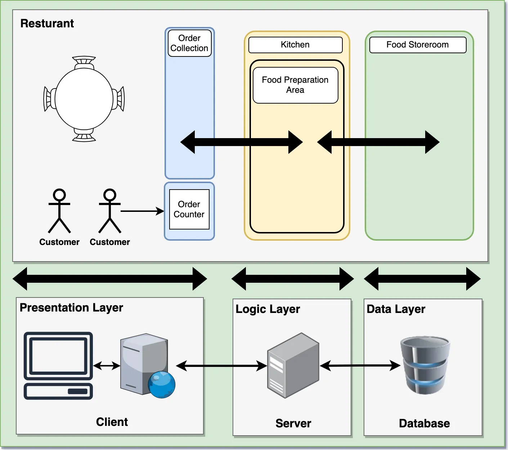
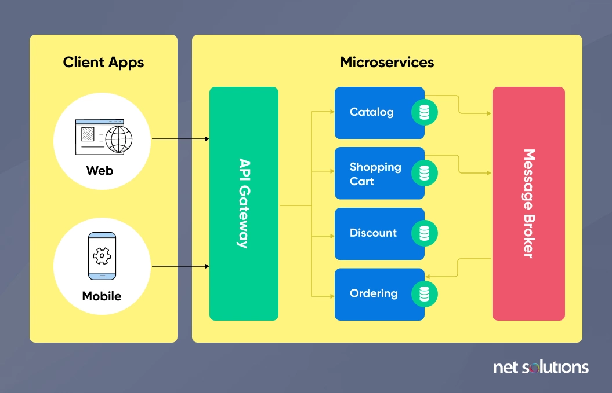

1:1
n:M

# 1. Layered Architecture

Layered Architecture는 소프트웨어 시스템을 계층으로 나누어 역할을 분리하는 아키텍처 패턴이다. 이를 통해 유지보수성과 테스트 용이성을 높일 수 있다.

## 주요 계층

- **프레젠테이션 계층 (Presentation Layer)**  
  클라이언트의 요청을 처리하고 응답을 반환하는 계층으로, 일반적으로 컨트롤러가 위치한다.

- **서비스 계층 (Service Layer)**  
  애플리케이션의 비즈니스 로직을 담당하며, 요청을 검증하고 데이터를 조회하거나 가공하는 역할을 한다.

- **데이터 접근 계층 (Data Access Layer)**  
  데이터베이스와 직접 상호작용하는 계층으로, 저장소(Repository) 패턴을 활용하여 데이터의 읽기 및 쓰기를 수행한다.

- **데이터 전송 객체 (DTO, Data Transfer Object)**  
  계층 간 데이터 전송을 담당하며, 도메인 모델을 직접 노출하지 않고 필요한 데이터만 포함하여 전달한다.

## 장점

- 유지보수와 확장이 용이하며, 특정 계층만 수정해도 되므로 변경 영향이 적다.
- 각 계층을 독립적으로 테스트할 수 있다.

## 단점

- 계층을 거치는 과정에서 성능 오버헤드가 발생할 수 있다.
- 계층이 많아지면 구조가 복잡해질 수 있다.

---

# 2. Microservices Architecture

Microservices Architecture는 애플리케이션을 여러 개의 독립적인 서비스로 구성하는 방식이다. 각 서비스는 개별적으로 개발 및 배포할 수 있다.

## 특징

- **서비스 독립성**  
  각 서비스는 개별적으로 수정·배포할 수 있어 애플리케이션 전체를 변경할 필요가 없다.

- **서비스 간 통신**  
  일반적으로 RESTful API나 메시지 큐를 사용하여 통신한다.

- **확장성 (Scalability)**  
  특정 서비스에 대한 요청이 급증하면 해당 서비스만 확장할 수 있다.

## 장점

- 독립적인 배포가 가능하여 개발 속도가 향상된다.
- 각 서비스가 개별 환경에서 동작하므로 다양한 기술 스택을 적용할 수 있다.

## 단점

- 서비스가 많아질수록 관리가 복잡해진다.
- 데이터 일관성을 유지하기 어렵고, 분산 트랜잭션 관리가 필요할 수 있다.
