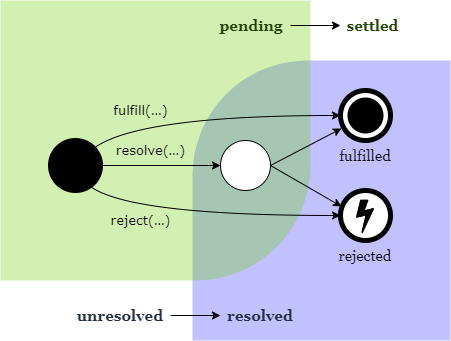

# 1. 절차지향과 객체지향의 차이

## 절차지향

TOP-DOWN방식으로 프로그래밍 및 동작하는 방식이다. 단순히 예전 C언어 프로그래밍을 생각하면 편하다.  
객체지향의 개념이 등장하기 이전부터 있었던 방식이며, 임베디드나 기타 로우레벨에서 보편적으로 사용되었다.(요새는 임베디드도 객체지향이 등장했다.) 과거의 방식인 만큼 단순한 소규모의 프로젝트에서는 굳이 객체지향을 할 필요가 없는 경우도 있고, 직관적이기 때문에 교육에서도 효과적이다.  
그러나 대규모 프로젝트의 방대한 양의 코드를 개발하고 관리함에 있어 절차지향은 많은 한계가 있었다. 같은 기능을 하는 함수가 제각각 적혀있기도 하고, 이 많은 코드가 어떤 역할을 수행하는지 알아보기도 어려웠다.

## 객체지향

새롭게 등장한 이 개념은 코드의 개발, 관리, 접근성 측면에서 훌륭한 활약을 보여주었다.
객체지향 프로그래밍은 임의의 기능을 하는 코드블럭을 객체라는 일종의 블랙박스로 취급하는 것이다. 이러한 접근으로 다음과 같은 장점을 얻어낼 수 있다.

- 모듈화
  모듈화한다는 것은 정해진 규칙에 맞게 객체를 만드는 것을 말한다. 다양한 형태의 객체를 같은 규칙을 가지는 모듈로 만들어 동일한 방식으로 컨트롤할 수 있게 된다.  
   같은 기능을 필요로 하는 곳에서 이 모듈화된 객체를 활용함으로써 중복코드 구현을 방지하고, 필요에 따라 상속을 통해 필요한 부분만 확장할 수 있다.

- 캡슐화
  객체는 정해진 기능을 제공하기 위해 내부에 변수나 기타 요소를 가질 수 있다. 이를 직접적으로 제공할 경우 개발자의 실수 혹은 객체에 대한 확실한 이해의 부재로 의도치 않은 상황이 발생할 수 있다. 이를 방지하기 위해 객체는 필요한 기능만을 제공하고 그 이외의 요소는 접근할 수 없게 하여 무결성을 보장할 수 있다. 이를 캡슐화라고 한다.

- 추상화
  캡슐화와 어느정도 같은 기능이지만 목적이 다른 개념이다. 개발자는 객체에 대해 특정 기능을 기대한다. 이를 위해 내부의 변수나 동작에 대해 관여하거나 신경을 쓸 필요가 없다. 때문에 객체의 활용에 있어, 개발자는 객체가 제공하는 필요한 기능을 활용할 뿐이다.

- 다형성
  객체를 활용하면서 이를 다양한 형태로 변형하여 필요한 상황에 맞게 사용할 수 있다는 특징이다. 객체의 상속이나 오버로드, 오버라이드가 대표적이다.

---

# 2. Promise의 3가지 상태

## 2.1 States


비동기 처리를 위해 promise를 활용할 때 3가지의 상태가 있다.

1. pending: 초기상태(대기)
2. fulfilled: 이행완료상태
3. rejected: 거부상태

또한 fulfiiled와 rejected된 상태를 합쳐 being settled(확정된)상태라고 한다. 이는 상태 중 하나는 아니며 편의상 표현일 뿐이다.

문법을 위한 예시 코드는 다음과 같다.

```
function getArticle(id) {
  return new Promise((resolve) => {
    instance
      .get(`articles/${id}`)
      .then((res) => {
        if (parseInt(res.status / 100) != 2) {
          throw new Error(res);
        } else {
          console.log(res.data);
          resolve(res.data);
        }
      })
      .catch((err) => {
        console.log(err);
      });
  });
}
```

## 2.2 Fates



상태 이외에도 promise는 resolved(해결된)와 unresolved(미해결된) fates가 있다.

### 2.2.1 Resolved

promise를 해결하기 위해 시도했을 때 효과가 없으면 해결된 것으로 간주한다. 원문을 보면 follow another promise의 이행을 위해 잠겨있는 경우를 예시로 든다. 위 예시 코드에서 .get(\`articles\${id}\`)가 이행되었건 거부되었건, 아니면 사실 .get()함수에 아무것도 개발되지 않아 텅 비어있건, 이후 .then()함수에 체인이 걸리게 되면 .get()이라는 promise는 해결이 된 fate라는 것이다.  
자체적으로 이행이나 거부가 되어도 해결된 것으로 간주한다.

### 2.2.2 Unresolved

unresolved는 해결되지 않은 fate로 정의된다.  
가능한 경우로는 일반적인 pending상태, 그리고 pending상태가 아니면서 이행 혹은 거부가 되지 않은 상태가 있을 것이다. 후자의 경우 예를 들어 텅 빈 promise를 초기화한 상태가 있다. 원문의 설명과 같이 "follow another promise의 이행을 위해 잠겨있는 경우"를 예시로 들면, 이런 promise는 .then()과 같이 체인을 걸 수 있는 다른 promise에 연결할 경우 이 자체가 해결을 위해 시도하는 행위이다. 떄문에 resolved에 대한 첫 설명과 같이 "해결하기 위해 시도했을 떄 효과가 없으면"을 만족하여 해결된 것으로 간주된다.
