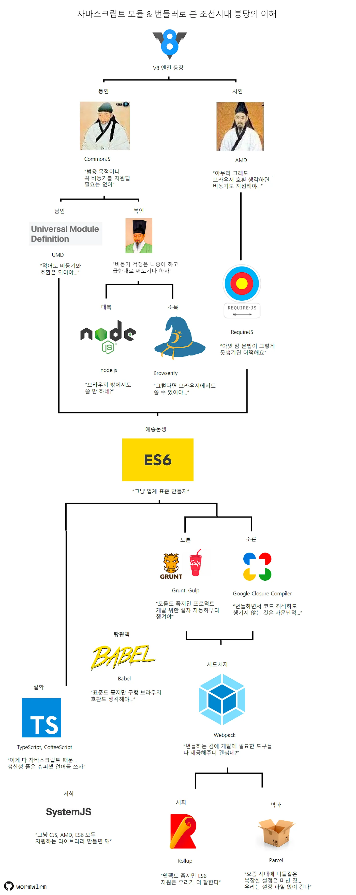
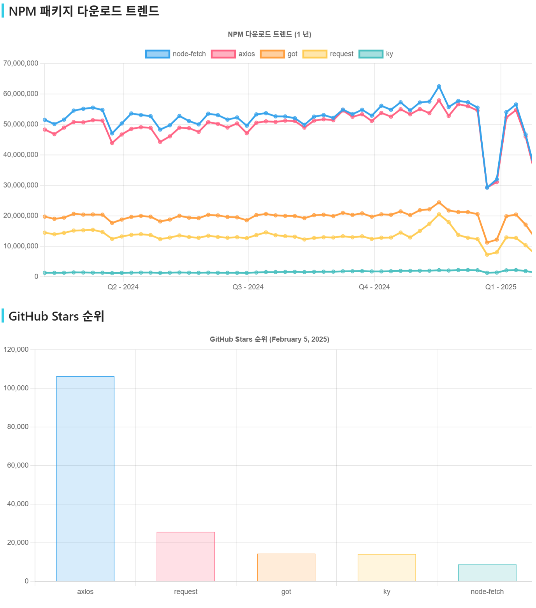

# 1. JS에서의 모듈의 필요성

1. 코드를 재사용 가능한 작은 단위로 나누어 관리할 수 있다.
2. 프로젝트 규모가 커질수록 코드 관리 및 유지 보수가 어려워지는데, 이를 해결하는 데 도움이 된다.
3. 이름 충돌을 방지할 수 있다.

JS를 브라우저 외적으로도 사용하기 시작하며, 또한 브라우저가 더 다양한 역할을 수행하기 시작하며 점점 많은 개발이 이루어졌다. 이 과정에서 모듈화는 자연스럽게 필요해졌고 CommonJS의 등장을 시작으로 변화해가는 환경에 맞춰 다양한 모듈 시스템이 발전되며 새롭게 등장했다. 당장은 CJS와 ESM만을 배웠지만 이후에 다른 배경도 상세히 알게 된다면, 모듈을 사용함에 있어 그 명확한 목적성을 인지하고 잘못 사용할 일을 방지한다거나 디자인 패턴에 도움이 될 수 있는 인사이트를 얻을 수 있을 것이다.



(이미지 및 내용 출처 : https://medium.com/@hong009319/자바스크립트의-표준-정의-commonjs-vs-es-modules-306e5f0a74b1)

---

# 2. Fetch API와 대조되는 Axios의 장점

사용자의 입장에서는, Fetch는 node에 내장되어 있고 Axios는 서드파티 라이브러리인 만큼, Axios에서는 통상적으로 사용되는 공통된 부분을 생략하였다는 점이 가장 큰 차이점이다. 아래의 예시가 대표적이다.

```
* 헤더의 입력
* 데이터의 파싱
* Response 에러코드의 reject 범위
```

이외에도 차이점이 있지만 상세한 차이를 아는 것보다 중요한 것은 Fetch와 Axios뿐만 아니라 유사한 기능의 라이브러리 별 특징과 그에 따른 취사선택이다. 하지만 자세히 알기는 어렵기 때문에 간단한 특징들(가볍다 vs 무겁다, 주 사용환경 등)을 알고 아래와 같이 다른 개발자들이 어떤 선택을 하였는지 참고하는 편이 좋을 것이다.


(출처 : https://npm-compare.com/ko-KR/axios,got,ky,node-fetch,request)
