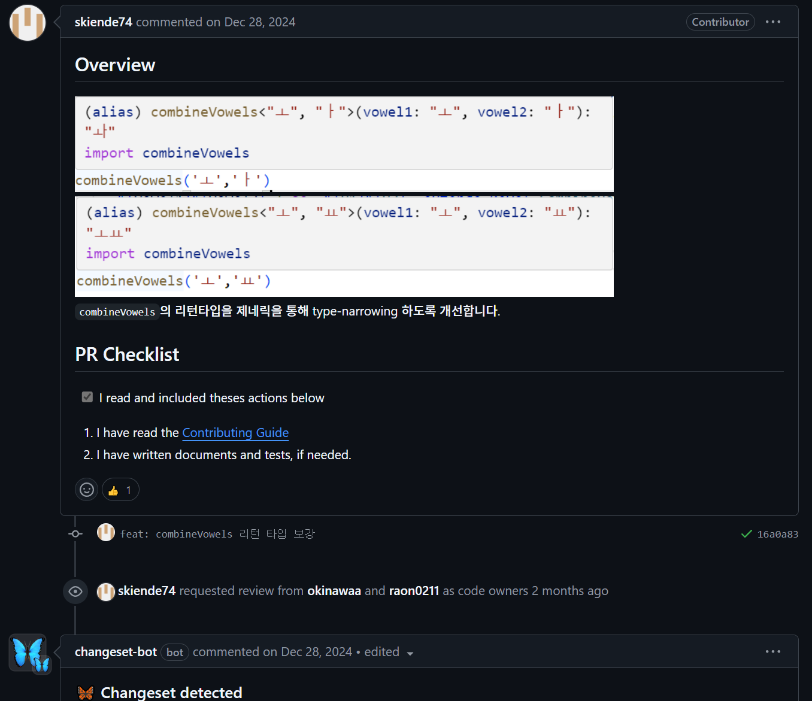
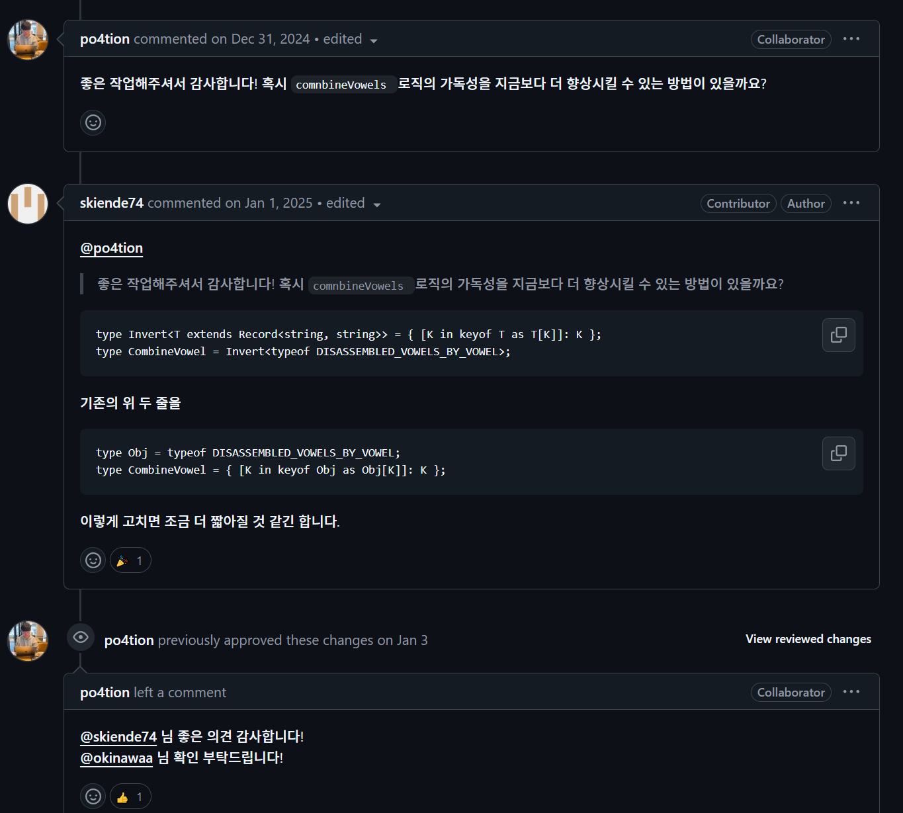
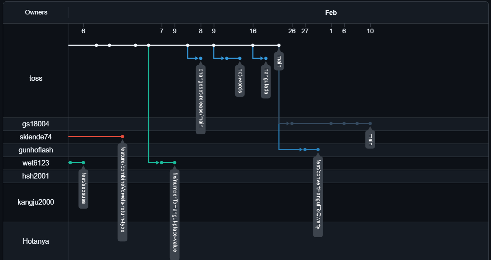

# 1. 백엔드에서의 CLI 명렁어의 활용성

서버는 gui같은거에 쓸 자원이 아깝다. 서버에는 몇 천 이상의 통신이 올 수도 있으며 각 요청의 작업을 최대한 빠르게 처리해주어야 하는 등 역할이 많기 때문에 CLI에 익숙해지면 해결되는 문제를 위해 리소스를 쓰는 사람은 없을 것이다.
다른 이유로는 CLI로도 충분히 문제들을 해결할 수 있기 때문이다. 자동화나 파이프라인 등이 CLI에서 가능하다 하지만 GUI에서 역시 프롬프트 창(CLI) 띄워서 하면 된다. CLI로 가능한 것들을 편하게 만든 것이 GUI이기 때문에 GUI에서만 해결 가능하고 CLI로 해결할 수 없는 문제는 없다.

---

# 2. Git을 통한 협업

```
https://github.com/toss/es-hangul?tab=readme-ov-file
```

toss 오픈 소스 프로젝트 중 하나인 es-hangul이다. JS에서 한글과 관련된 작업을 수행하는 데에 도움을 주는 라이브러리이다.
es-hangul은 포크된 active repo가 수십 개가 있다. 개발자는 개발을 완료한 뒤 PR을 진행한다.



PR 시 어떤 작업을 진행하였는지 간단한 요약과 프로젝트에서 제시하는 체크리스트를 포함한다.



별다른 문제가 없다면 apporved되어 merge될 것이다.  
PR 중에는 버그가 있거나 Reviewer의 의견과 맞지 않은 내용이 있을 수 있다. 그럴 때에는 아래 링크와 같이 논의가 이루어진다.

```
https://github.com/toss/es-hangul/pull/204
```



최종적으로 merge된 branch는 소멸시키며 아직 진행중인 branch들만이 남아있는 모습이다.
