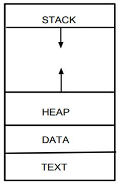

# 1. 프로세스와 스레드

프로세스와 스레드

 
프로그래밍 분야에 존재하는 수많은 개념중에서도 프로세스와 스레드는 중요한 개념에 속한다. 그리고 중요한 만큼 많은 내용이 담겨있다. 그 중에서도 기억하기에 간단하면서 중요한 내용을 위주로 소개한다.

## 1.1 프로세스

스토리지에 저장되어 있는 프로그램은 실행되기 위해 메모리에 올라가게 되고 이 상태를 프로세스라 한다. 한 번에 모두 올라가는 것은 아니고 구동에 필요한 코드와 그 순간에 필요한 데이터를 올려가며 사용한다. 재료 손질을 위해 도마에 식재료를 번갈아 올려가며 사용하는 것과 같다.

프로세스는 그림과 같이 구성된다.

- stack
  프로세스의 실행 과정에서 발생하는 스택을 보관하는 부분이다. 디버깅 시의 stack trace를 생각하면 이해하기 쉽다. 프로세스 실행에서 출발하여 몇가지 과정을 거쳐 main을 실행하고 그 안에 있는 함수나 외부 종속성의 호출, 실행 완료 후 그 이전으로 돌아가 이어서 진행을 하는 바로 그 스택이다.

- heap
  프로세스의 메모리라고 부를 수 있는 부분이다. 기본적인 malloc처럼 동적으로 할당되는 데이터는 이곳에 위치한다.

- data
  힙이 동적으로 할당되는 곳이었다면 이곳은 정적으로 할당되어있는 부분이다. 그래서 크기가 변하지 않는다.

- text
  보통 코드영역이라고 부르며 말 그대로 코드가 위치한다.

메모리에 올라간 프로세스와 cpu가 데이터를 주고받으며 연산이 끝나면 프로세스는 메모리에 대기하거나 내려갈 수 있다. 하지만 그 과정에서 cpu는 다른 작업도 진행해야한다. 프로세스는 하나가 아닐 뿐더러 cpu는 커널단(os)의 일도 수행해야 하기 때문이다. 이 과정에서 필연적으로 cpu가 진행하는 작업을 변경해야 하는데 이를 컨텍스트 스위칭이라고 한다.

### Context Switching

OS를 공부하다 보면 중요한 개념으로 강조되는 것 중 하나인 컨텍스트 스위칭이다.

그림에는 두 프로세스가 스위칭되는 상황을 예로 들었다. 초록 선은 현재 cpu에서 연산하는 중인 상태이다. 실행 도중 작업을 멈추고 작업공간의 데이터를 저장 및 클리어하고 pcb를 참조해 다른 프로세스의 진행을 위한 준비를 한다. 여기서는 프로세스를 예로 들었지만 커널의 작업이 될 수도 있다.

  
pcb란 process control block으로 이름 그대로 프로세스를 위한 데이터블록이다. 프로세스에 태그처럼 달려있는 것이라 생각하면 된다. 그림처럼 스위칭에 활용되기도 하고 프로세스와 관련된 정보나 아주 작은 크기의 저장소(전에 어디까지 했었는지)를 포함하고 있어 전체 프로세스의 스케쥴링에도 쓰일 수 있다.

진행을 살펴보면 초록색 부분이 존재하지 않는 시간이 오버헤드로서 발생하는 것을 볼 수 있다. 그렇다면 굳이 손해보지 않고 한 작업을 최대한 길게 가져가는 것이 효율적이라고 생각할 수 있지만 이것은 멀티태스킹을 위함이다. 동시성과 함께 사용자의 편의성을 예로 들어 설명하기도 한다. 꼭 편리함이 아니라 성능적인 관점으로 보아도 병렬처리 등의 이유로 컨텍스트 스위칭은 필연적이다.

## 1.2 스레드

  
cpu에서 여러 프로세스가 번갈아 작업을 진행했다면, 프로세스 내에서는 이와 유사한 스레드라는 것이 있다. 스레드는 프로세스의 실행부를 지칭한다. 프로세스가 실행되면서 쌓이는 stack과 그 실행 자체의 정보를 담아두는 tcb로 구성된다. tcb는 pcb의 스레드 버전이다. 프로세스의 그림을 보면 힙, 데이터, 코드영역이 한 곳에 모여있고 스택이 따로 있는 것을 볼 수 있다. 당연하게도 복수의 스레드를 활용한다고 상상하면 이 세 영역은 공유가 가능하며 스택은 그렇지 않다는 것을 알 수 있을 것이다.  
따로 지정을 하지 않으면 프로세스는 이미 싱글 스레드 상태이다. 특정한 기능을 구현하기 위해서 개발자는 코드 내에 직접 멀티스레딩을 작성할 수 있다. 멀티프로세싱과 달리 코드로 확인할 수 있으면서, 프로세스 내에서의 스레드간 스위칭이기 때문에 오버헤드가 작고 접근성도 좋다. 하지만 오버헤드가 없는 것은 아니기 때문에 잘못짜면 싱글스레드보다 못한 상황이 발생할 수도 있다. 목적에 따라 이를 알맞게 구현하는 것은 개발자의 역량이다.

---

# 2. 프레임워크와 라이브러리

프레임워크와 라이브러리

 
프레임워크와 라이브러리의 차이를 이해하는 좋은 방법 중 하나는 전체 그림을 이해하는 것이다.  
시대가 발전하면서 프로그래밍이라는 행위는 어셈블리어나 찍던 극초창기에서 딸깍 한번에 기능이 완성되는 현재까지 high-level을 넘어 계속해서 올라가고 있다. 그 과정에서 나타난 개념들은 분명히 이유와 목적, 관계가 있다. 이것을 건너뛰고 외딴섬처럼 프레임워크 vs 라이브러리만을 기억한다면 '그렇다면 vs프로그래밍언어는? vsIDE? vs컴파일러, 인터프리터?, vsAPI?'와 같은 의문을 해결할 수 없을 것이다. 그렇기 때문에 주변 개념까지 간단히 설명힌다.

## 2.1 간단한 배경

  
자바스크립트는 이름 그대로 스크립트 언어로서 인터프리터의 도움을 받아(때로는 컴파일러도 동작하여) 기계어로 변환되고 메모리에 올라가 프로세스가 된다.
  

  
이 자바스크립트라는 프로그래밍 언어로 특정 기능을 수행하기 위해 작성하여 모듈화한 것이 라이브러리이며, node.js는 이 라이브러리의 묶음과 인터프리터를 합한 일종의 자바스크립트 플랫폼 혹은 런타임 환경이라고 표현할 수 있다.
  

  
이러한 프로그래밍 언어를 작성하고 컴파일, 실행하거나 디버깅, 배포하는 등 코드 작성 및 개발에 필요한 많은 기능을 포함하여 연동한 프로그램을 IDE(Integrated Development Environment)라도 한다. 현재 사용하고 있는 vscode를 비롯하여 visual studio, eclipse, xcode 등 다양한 IDE과 목적과 언어와 환경에 따라 쓰이고 있다.

## 2.2 라이브러리

라이브러리란 앞서 말한 것처럼 특정 기능을 위해 작성된 코드가 모듈화된 것이다.  
현재 사용중인 npm의 경우, node.js에서 쓰이는 라이브러리들을 관리할 수 있는 프로그램으로서 dotenv, is-uuid와 같은 라이브러리를 설치, 관리할 수 있다.

## 2.3 프레임워크

  
라이브러리 중에서도 굉장히 많은 기능을 포함하고 있으며, 개발자는 사실상 그 라이브러리 위에서 약간의 로직을 구현하는 것으로 원하는 프로젝트를 구현할 수 있는, 라이브러리임에도 마치 뼈대와 같은 역할을 하는 라이브러리를 프레임워크라고 한다. express가 바로 유명한 프레임워크 중 하나이다.  
express에 대한 설명을 보면 'node.js를 위한 웹 프레임워크'라고 소개하고 있다. 이처럼 프레임워크는 보통 특정 환경에 대해 종속되어 있는 케이스가 대부분이다.

node.js의 경우 위와 같은 depth가 있는 것을 소개하였지만, 다른 언어나 환경은 이와 다른 구조를 가질 수도 있다.

