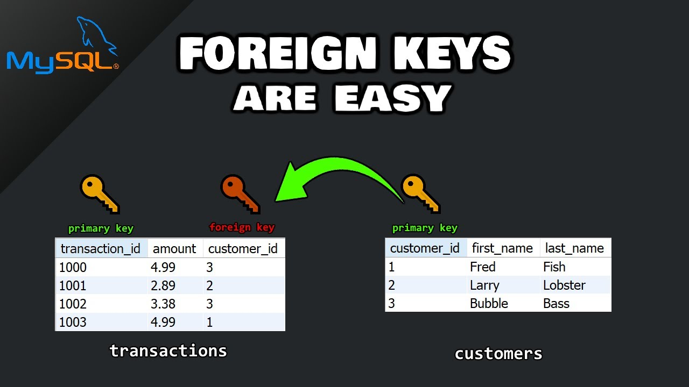
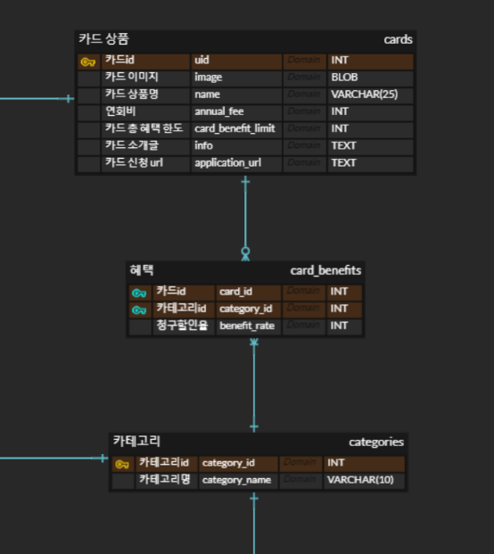

# 1. RDB와 NoSQL

과거 DB를 필요로 하는 프로젝트 중에 RDB를 사용하지 않는 경우는 거의 없었다. RDB로 설계하려면 할 수 있는 상황이 대부분이었으며 실제로 문제없이 동작하였다. 그러다 ML, 빅데이터의 시대가 도래하면서 조금씩 성장하고 있던 NoSQL이나 하둡과 같은 프레임워크가 각광받기 시작했고, 지금은 RDB와 DBMS 생태계를 양분하는 비 관계형 데이터베이스들이 자리잡게 되었다.

## 웹 서비스에서 RDB를 사용하는 이유

비 관계형 DB의 성장 배경을 생각해보면 굉장히 많은 데이터를 빠르게 처리해야 할 때 효과적인 것을 알 수 있다. RDB와 비교하여 비 관계형 DB는 이 특징으로부터 파생된 여러 차이점을 가질 것이다. 하지만 핵심적인 것은 빅데이터의 빠른 처리이다.  
웹 서비스에서는 RDB와 비 관계형 모두 사용한다. 그 중 RDB를 사용하는 이유는 기존에 RDB를 써왔던 것과 같이 서비스 제공에 있어 각 개체간의 상호작용을 활용할 수 있고, 중요한 내용에 대해 안전성이나 무결성을 보장할 수 있다. 반면 비 관계형은 어떠한 연산이나 관계가 필요없는 직접적인 조회가 많은 케이스에 강하다.

아래는 한 개발자의 SNS 프로젝트 게시글의 일부이다.

- 알림 db 의 경우 테이블의 형태가 간단하고, 조인연산이 없기 때문에 빠른 읽기 연산이 가능한 nosql(mongodb)을 사용하여 구현하였다.
- 게시물(post) db 의 경우 SNS 특성상 쓰기 연산보다는 읽기 연산이 현저히 많다는 특징을 고려하여, 빠른 읽기 연산이 가능한 nosql(mongodb)을 사용하여 구현하였다.
- 댓글 db 의 경우 초반에는 nosql 을 이용하려고 하였으나, 유저 db 와 post db 와 관계가 맺어져있고 조인연산이 빈번히 일어나는 특징을 고려하여 mysql 로 구현하였다.

[출처](https://creakycogwheel.tistory.com/entry/SNS%ED%94%84%EB%A1%9C%EC%A0%9D%ED%8A%B8-%ED%9A%8C%EA%B3%A0RDBMS-vs-NOSQL)

---

# 2. Primary Key와 Foreign Key

 
PK(기본키)는 각 Tuple에 대해 유니크한 값이며 해당 Tuple을 특정하기 위한 키로서 사용된다. PK는 1개 이상의 컬럼를 복합키로서 사용할 수 있다. 이때 PK는 각 컬럼을 모두 합친 하나의 복합키로 작용하게 된다.   
FK(외래키)는 ERD에서의 Relation이 표현된 것으로 테이블에서는 다른 테이블의 컬럼을 참조한 값이다. FK는 ERD에 따라 nullable이거나 한 테이블에서 복수의 컬럼을 참조하거나 다수의 테이블에서 각각 참조하는 등 다양한 형태로 구성할 수 있다.

 

 

경우에 따라서는 A테이블에서의 FK_A, B테이블에서의 FK_B를 합하여 FK_A + FK_B를 복합키인 하나의 PK로 사용할 수도 있다.

[UP](#1-rdb와-nosql)

.highlight pre{
white-space: pre-wrap;
}
