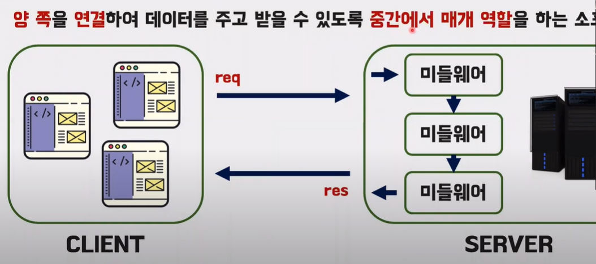
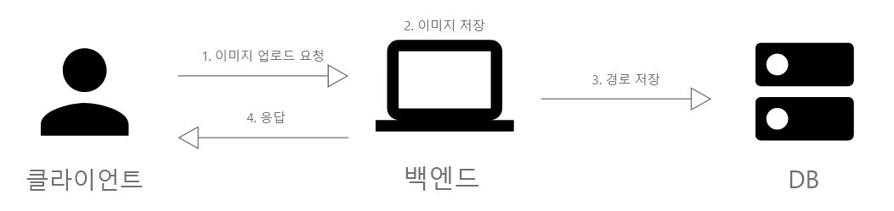
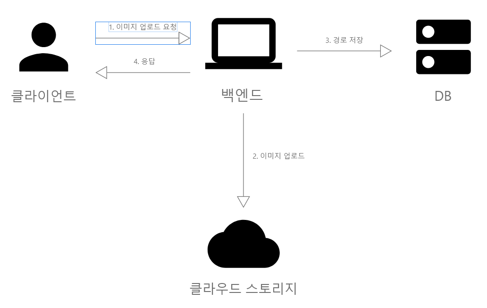
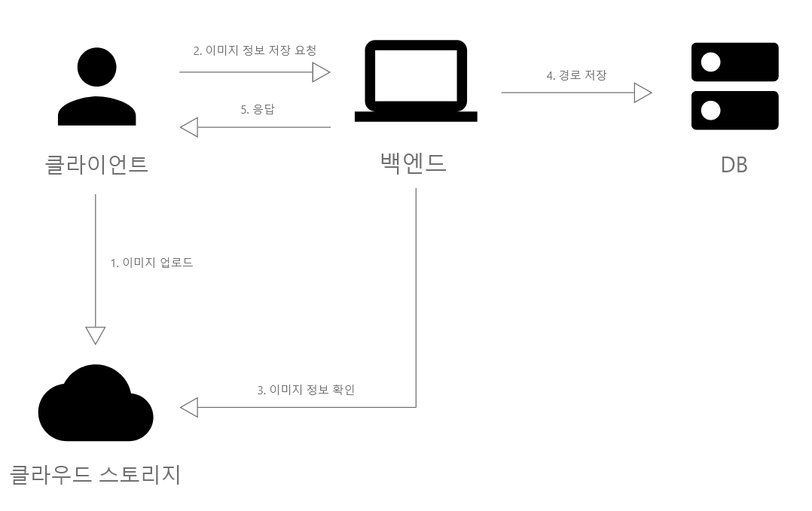

# 1. Express에서의 미들웨어

<div align="center">

</div>
<br/>
Express에서의 미들웨어는 클라이언트로부터 오는 요청과 서버에서 보내는 응답 사이의 작업을 처리하는 부분이다. 개발자가 작성하는 부분도 원론적으로는 미들웨어에 속한다고 볼 수 있다.
<br/><br/>

```javascript
const express = require("express");
const morgan = require("morgan");
const cookieParser = require("cookie-parser");
const session = require("express-session");
const dotenv = require("dotenv");
const path = require("path");

dotenv.config();
const app = express();
app.set("port", process.env.PORT || 3000);

app.use(morgan("dev"));
app.use("/", express.static(path.join(__dirname, "public")));
app.use(express.json());
app.use(express.urlencoded({ extended: false }));
app.use(cookieParser(process.env.COOKIE_SECRET));
app.use(
  session({
    resave: false,
    saveUninitialized: false,
    secret: process.env.COOKIE_SECRET,
    cookie: {
      httpOnly: true,
      secure: false,
    },
    name: "session-cookie",
  })
);

app.use((req, res, next) => {
  console.log("모든 요청에 다 실행됩니다.");
  next();
});
app.get(
  "/",
  (req, res, next) => {
    console.log("GET / 요청에서만 실행됩니다.");
    next();
  },
  (req, res) => {
    throw new Error("에러는 에러 처리 미들웨어로 갑니다.");
  }
);

app.use((err, req, res, next) => {
  console.error(err);
  res.status(500).send(err.message);
});

app.listen(app.get("port"), () => {
  console.log(app.get("port"), "번 포트에서 대기 중.");
});
```

<br/>

Express에서 기본적으로 제공하는 미들웨어 함수는 express.static이 유일하다. 그 이외에는 위와 같이 서드파티 라이브러리를 활용하거나 직접 개발한다. use api를 작성할 때 인자를 4개로 설정하면 에러핸들러로 동작하도록 개발되어있다.

---

# 2. 백엔드에서의 이미지 업로드 구현

이미지 업로드의 구현은 다양한 방법이 있지만 실제 사용되는 것은 일부에 국한된다. 검색을 통해 발견한 방법을 소개한다.

## 권장되지 않는 방법

### blob으로 DB에 저장

DB의 대용량 데이터 타입인 blob을 활용하여 DB에 직접 넣는 방식이다. 이미 DB에 바이너리를 직접 넣는다는 것부터 성능의 낭비이므로 권장되지 않는다.

### base64로 DB에 저장

포스트에서 설명하는 내용에 따르면 base64로 인코딩하면 용량이 더 커진다고 한다. 게다가 꺼낼 때 디코딩도 해야하니 blob보다 좋은 점을 찾기 어렵다. DB에 넣는데 암호화를 하려는 것인지 출처를 알기 힘든 방법이다.

## 권장되는 방법

### 파일은 백엔드에, 경로는 DB에 저장

<div align="center">

</div>
<br/>
직관적으로 생각했을 때 가장 떠올리기 쉬운 방법이다. 논리적으로 보면 깔끔하고 개발로직도 단순하다. 실제로 이 방식으로 구현되는 서비스도 존재한다. 하지만 아래와 같은 단점이 있다.

- 용량
  서버는 구동을 위한 로직이 담겨있는 코드가 주를 이루게 된다. 상황에 따라 다르겠지만 만약 서버를 로컬PC로 돌린다면 저장되는 파일의 용량은 한계를 맞이할 것이다. 클라우드 서비스를 활용할 경우 스토리지를 전문으로 하는 서버로 분리하는 것이 경제적이다. 이미지를 예시로 들었지만 동영상을 비롯한 더 큰 파일이라면 더욱 문제가 될 것이다.

- 처리속도
  서버는 수많은 통신을 핸들링하면서 내부 로직도 실행하는 동시에 각 작업의 속도와 품질을 보증해야 한다. 성능을 위해 GUI도 제거한 백엔드에서 이미지의 업/다운로드는 많은 리소스를 소모한다.

- 보안
  서비스에 따라 다르겠지만 서버에 저장하는 파일은 개인의 영상 등 회사의 소유가 아닐 가능성이 높다. 만일 서버에 접근하는 사람이 직원 혹은 협력업체일 경우 파일이 직접적으로 노출될 수 있어 추가적인 조치가 필요하다. 서버를 분리하면 이러한 조치가 간편해진다.

때문에 이런 방식은 서버에 저장할 파일이 정말 소규모일 경우 활용할 수 있다.

### 백엔드에서 클라우드에

<div align="center">

</div>
<br/>
이미지를 백엔드에서 클라우드로 전송해 저장하는 방법이다. 백엔드에 저장하는 방법과 비교하면 몇 가지 차이점이 있다.<br/>
우선 상술한 용량과 보안 관련 문제가 해결된다. 또한 서버를 분리함으로써 서버에 문제가 발생했을 때 위험을 분산시킬 수 있다.<br/>
하지만 결국 이미지를 백엔드에서 제공해야 한다는 점에서 작업량에 관한 문제는 완전히 해결되지는 않는다.

### 클라이언트에서 클라우드에

<div align="center">

</div>
<br/>
클라이언트에서 클라우드에 직접 전송하는 방법이다.<br/>
이 방법은 백엔드의 작업량을 줄여 서버의 성능을 끌어올릴 수 있지만 단점이 있다. 이 방식을 위해서는 서버에서 클라이언트에게 클로우드에 접근할 권한을 주어야 한다. 이는 보안에 큰 문제를 야기할 수 있다.<br/>

공격자에게 있어 클라이언트 혹은 그 통신을 조작하는 것은 비교적 쉬운일이다. 공격자가 클라우드에 의미없는 대용량의 파일을 전송하게 되면 서버 비용이 늘어나게 된다. 또한 캐시나 쿠키, 세션 등을 활용한 악성 코드에 당한 다른 사용자로부터 해당 사용자의 접근권한을 얻는다면 파일의 유출도 일어날 수 있다. 사용자가 당했는데 우리 서버가 털리는 상황이 일어나게 되는 것이다. 그렇기 때문에 출처 게시글에서는 하나의 권장되는 방법으로 소개하였지만 개인적인 관점으로는 이것은 실 서비스에서는 지양해야 할 방법으로 보인다.<br/>

### 생각한 방안

이런 방법도 생각해 볼 수 있다. 백엔드 서버 이외에 이미지 전용 서버를 하나 더 만들고 해당 서버를 거쳐 클라우드에 도달하게 설계하는 것이다. 기존 백엔드 서버는 본연의 성능에 집중할 수 있고, 이미지 서버는 클라우드에 접근하는 보안을 담당한다.<br/>
좋은 방법처럼 보이지만 역시 문제가 있다.<br/>

- 백엔드에서 클라우드에 저장하는 것처럼, 클라이언트에서 클라우드에 저장하는 방법과 비교하였을 때 이미지가 두 번 송수신되어 속도에 차이가 생길 수 있다.
- 단순 파일 업로드가 아니라 게시글에 포함된 이미지와 같이 기존 백엔드와 함께 동작해야 하는 경우, 기존 방식과 비교하면 사용자 경험이 조금 어색해질 수 있다.
- 추가적인 개발 및 서버의 사용으로 비용이 증가한다.

서비스의 형태와 목적에 따라 다르겠지만, 가장 무난한 방법은 백엔드에서 클라우드에 저장하는 방법일 것이다.

출처: https://inpa.tistory.com/entry/EXPRESS-%F0%9F%93%9A-%EB%AF%B8%EB%93%A4%EC%9B%A8%EC%96%B4-%F0%9F%92%AF-%EC%9D%B4%ED%95%B4-%EC%A0%95%EB%A6%AC
