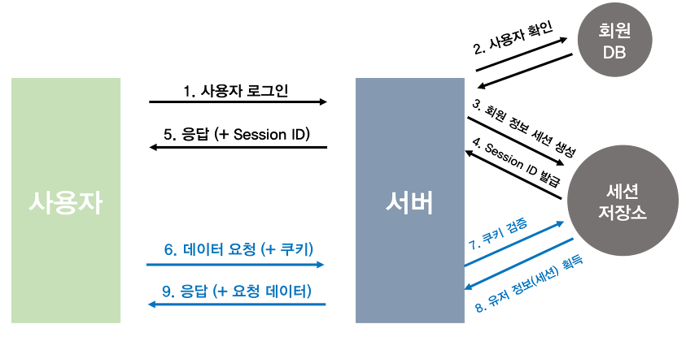
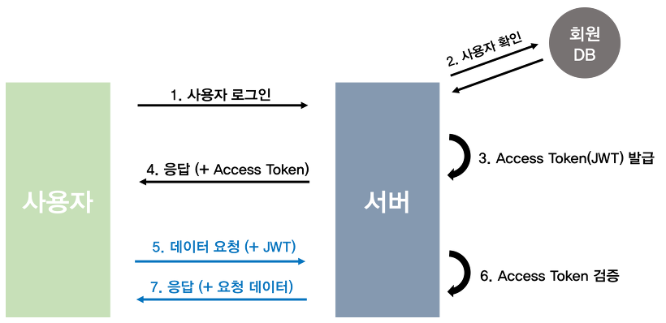

# 1. 세션 기반 인증

 
세션 기반 인증은 사용자가 로그인한 후 일정 기간 동안 인증된 상태를 유지하도록 하는 방식이다. 먼저 사용자가 로그인 요청을 보내면, 서버는 이를 데이터베이스와 대조하여 사용자의 정보를 확인한다. 인증이 성공하면 서버는 세션 저장소에 해당 사용자에 대한 세션을 생성하고, 고유한 세션 ID를 발급한다. 이후 서버는 이 세션 ID를 사용자에게 응답으로 전달하며, 일반적으로 쿠키에 저장하여 클라이언트 측에서 관리하게 한다. 사용자가 이후 데이터를 요청할 때마다 세션 ID를 함께 전송하면, 서버는 세션 저장소에서 해당 세션을 검증하고 사용자 정보를 조회한 후 요청에 대한 응답을 반환한다. 이를 통해 사용자는 로그인 상태를 유지하면서도 매번 자격 증명을 다시 입력할 필요 없이 서비스를 이용할 수 있다.
 

---

# 2. 토큰 기반 인증

 
토큰 기반 인증은 사용자가 로그인한 후 발급된 토큰을 이용해 인증된 상태를 유지하는 방식이다. 먼저 사용자가 로그인 요청을 보내면, 서버는 데이터베이스와 대조하여 사용자의 정보를 확인한다. 인증이 성공하면 서버는 해당 사용자에 대한 Access Token을 생성하여 발급한다. 이후 서버는 이 Access Token을 사용자에게 응답으로 전달하며, 사용자는 이후 요청을 보낼 때마다 이 토큰을 함께 전송한다. 서버는 요청을 받을 때마다 Access Token을 검증하여 유효성을 확인한 후 요청에 대한 응답을 반환한다. 이를 통해 사용자는 별도의 세션을 유지할 필요 없이 토큰을 이용해 인증을 수행할 수 있다.
