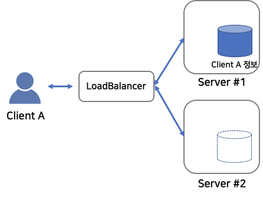
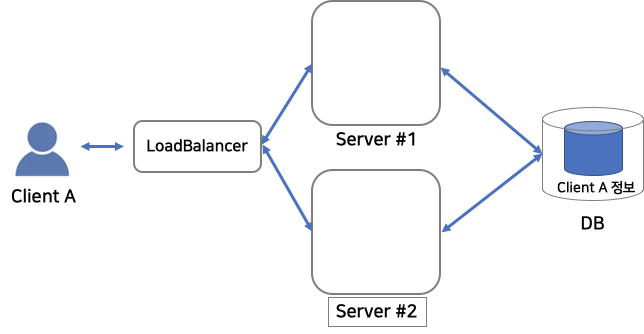
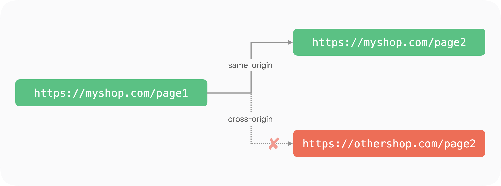

# 1. REST에서의 Stateless

REST에서 Stateless란 서버가 클라이언트의 이전 요청 상태를 저장하지 않는다는 개념이다. 각 요청은 독립적으로 처리되며, 서버는 요청이 오기 전의 클라이언트 상태를 기억하지 않는다.

## Stateful

 

만약 Stateful한 방식을 사용하면, 서버는 클라이언트의 상태를 세션으로 관리해야 한다. 예를 들어, 사용자가 로그인하면 서버는 해당 사용자의 로그인 정보를 세션에 저장하고, 이후 요청에서는 별도의 인증 정보 없이도 로그인 상태를 유지할 수 있다. 이런 방식을 사용할 경우 아래와 같은 문제점을 고려할 수 있다.

1. 확장성이 떨어진다. 클라이언트의 상태를 유지하려면 모든 요청이 같은 서버로 가야 하기 때문에 부하가 한 서버에 집중될 수 있다. 만약 부하 분산을 위해 여러 서버를 운영한다면, 각 서버가 세션 정보를 공유해야 하는 추가적인 복잡성이 발생한다.
2. 서버의 리소스 사용량이 증가한다. 각 클라이언트의 상태를 저장하려면 서버의 메모리와 스토리지를 지속적으로 사용해야 하며, 많은 사용자가 동시에 접속할 경우 서버의 부담이 커질 수 있다.
3. 장애 복구가 어렵다. 서버가 재시작되거나 장애가 발생하면 세션 정보가 사라질 수 있으며, 사용자는 다시 로그인해야 하는 불편을 겪게 된다.

## Stateless

 

 

이러한 문제를 해결하기 위해 REST에서는 Stateless한 구조를 활용한다. 클라이언트가 매 요청마다 필요한 모든 정보를 포함하여 서버에 전달하면, 서버는 각 요청을 독립적으로 처리할 수 있어 확장성과 유지보수성이 향상된다. 예를 들어, 인증이 필요한 경우 클라이언트는 요청마다 토큰을 함께 전송하여 인증을 수행하며, 서버는 상태를 저장할 필요 없이 각 요청을 별도로 검증하면 된다. 이를 통해 서버의 부담을 줄이고, 부하 분산과 장애 대응이 용이해진다.
 

---

# 2. CORS

 
CORS(Cross-Origin Resource Sharing)는 웹 브라우저에서 보안상의 이유로 다른 출처의 리소스를 제한하는 정책을 우회하기 위한 방법이다. 기본적으로 웹 브라우저는 SOP(Same-Origin Policy)라는 보안 정책을 따르는데, 이는 요청을 보낸 웹사이트의 출처와 다른 출처에서 온 리소스를 차단하는 원칙이다. 출처는 URL의 프로토콜, 도메인, 포트 번호로 구성되며, 이 중 하나라도 다르면 다른 출처로 간주된다. 
예를 들어, 프론트엔드 서버가 https<k>://myshop.com이고, 백엔드 서버가 https<k>://othershop.com이라면, 백엔드에서 데이터를 가져오려는 요청은 SOP에 의해 차단된다. 하지만 백엔드 서버에서 특정 출처에 대한 CORS 정책을 허용하면 이러한 요청을 정상적으로 처리할 수 있다. CORS는 서버 측에서 응답 헤더를 설정하여 특정 출처에서의 요청을 허용하는 방식으로 동작한다. 
SOP는 악의적인 웹사이트가 사용자의 데이터를 무단으로 가져가는 것을 방지하기 위해 존재하지만, 필요한 경우 CORS를 통해 특정 출처와 리소스를 공유할 수 있도록 설정할 수 있다.
